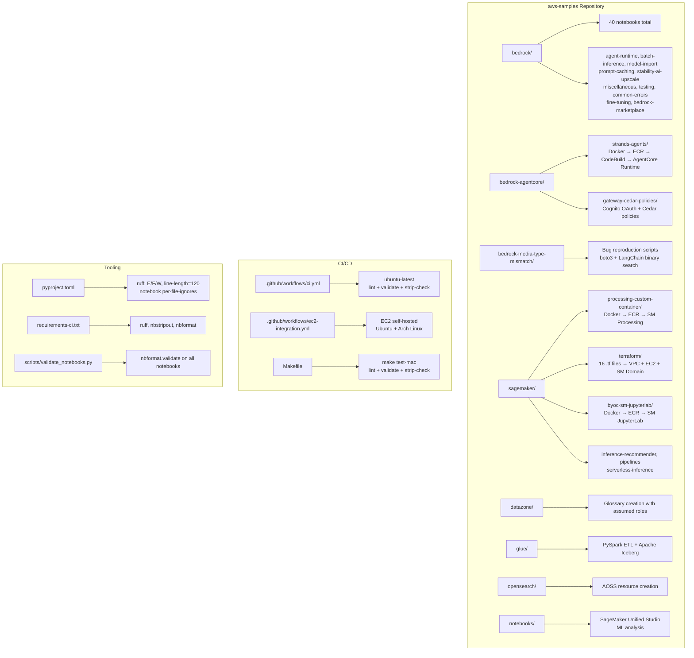

# aws-samples-agent Enhancement — Final Investigation Report

**Date:** 2026-05-24  
**Lead Investigator:** Kiro (claude-sonnet-4.6-1m)  
**Investigation ID:** c3ec006e  
**Streams:** c1-internet, c2-kb, c3-context, c4-docs, c5-internal  

---

## Executive Summary

The current `aws-samples-agent` prompt (~1343 chars) contains **3 confirmed factual errors** and **omits 4 of 8 service directories**. The project is a personal AWS learning repository with 40 Jupyter notebooks, 13 Python scripts, 16 Terraform files, and 5 Dockerfiles spanning 8 AWS service areas. It uses Python exclusively (no TypeScript, no CDK, no SAM). The enhanced prompt below corrects all errors, adds all missing directories, and adds a Critical Rules section — the highest-ROI section per shared learnings.

**CloudWatch metrics note:** c5-internal could not access internal tooling (Midway auth expired). No CloudWatch queries were applicable — this is a personal learning repo with no production metrics to query.

---

## Confirmed Findings

### F1 — Current Prompt Has 3 Factual Errors
**Confidence: HIGH | Sources: c3-context (filesystem), c5-internal (filesystem), c4-docs/validated.md**

| # | Current Prompt (Wrong) | Correct Value | Verified By |
|---|------------------------|---------------|-------------|
| 1 | `Language: Python + Shell + CloudFormation/SAM` | Python + PySpark + HCL (Terraform) + Shell | Direct filesystem: no `cdk.json`, no `template.yaml`, 16 `.tf` files |
| 2 | `Use SAM/CloudFormation for infrastructure` | Terraform (`sagemaker/terraform/`), Docker+ECR (`bedrock-agentcore/`) | Direct filesystem |
| 3 | `make test` | `make test-mac` (macOS local target) | Direct Makefile read |

### F2 — Current Prompt Omits 4 Service Directories
**Confidence: HIGH | Sources: c3-context, c5-internal, c2-kb**

Missing from current prompt:
- `opensearch/` — Amazon OpenSearch Serverless (AOSS) resource creation
- `sagemaker/` — SageMaker ML samples (6 subdirs, 13 notebooks, 16 Terraform files)
- `notebooks/` — General-purpose Jupyter notebooks (SageMaker Unified Studio)
- `bedrock-media-type-mismatch/` — Bug reproduction for Bedrock Converse API media type validation

### F3 — Project File Counts (Verified)
**Confidence: HIGH | Sources: Direct filesystem count**

| Type | Count | Notes |
|------|-------|-------|
| Jupyter notebooks | 40 | Excludes `investigation/`, `kiro-*` |
| Python scripts | 13 | Excludes `.venv/` |
| Terraform files | 16 | All in `sagemaker/terraform/` |
| Dockerfiles | 5 | `bedrock-agentcore/`, `sagemaker/` (3 BYOC + 1 processing) |

### F4 — Makefile Targets (Verified)
**Confidence: HIGH | Sources: Direct Makefile read**

```makefile
lint        → ruff check .
validate    → python scripts/validate_notebooks.py (nbformat schema)
strip-check → nbstripout --verify on all notebooks
test-mac    → lint + validate + strip-check (macOS local entrypoint)
```

`make test` does **not** exist. `test-mac` is the only composite target.

### F5 — Deployment Patterns (Verified)
**Confidence: HIGH | Sources: c3-context, c5-internal, c2-kb**

| Pattern | Used By |
|---------|---------|
| Docker → ECR → CodeBuild → AgentCore Runtime (ARM64) | `bedrock-agentcore/strands-agents/` |
| Docker → ECR → SageMaker Processing Job | `sagemaker/processing-custom-container/` |
| Docker → ECR → SageMaker JupyterLab BYOC | `sagemaker/byoc-sm-jupyterlab/` |
| Terraform IaC (`terraform init && terraform apply`) | `sagemaker/terraform/` |
| Direct boto3 API calls (no deployment) | Most `bedrock/` notebooks |
| GitHub Actions CI/CD | `.github/workflows/ci.yml` + `ec2-integration.yml` |

### F6 — AgentCore Is a 12-Service Modular Platform
**Confidence: HIGH | Sources: c4-docs (official AWS docs), c4-docs/validated.md**

Services: Runtime, Harness, Memory, Gateway, Identity, Code Interpreter, Browser, Observability, Payments, Evaluations, Policy, Registry. Supports MCP and A2A protocols. Framework-agnostic (Strands, LangGraph, CrewAI, Google ADK, OpenAI Agents SDK).

Key quotas: 2GB max Docker image, 250MB compressed deploy package, 15min sync timeout, 8hr async max.

### F7 — Real AWS Account ID in .bedrock_agentcore.yaml
**Confidence: HIGH | Sources: c2-kb, c5-internal**

The file `bedrock-agentcore/strands-agents/.bedrock_agentcore.yaml` contains a real AWS account ID and IAM role ARNs. The enhanced prompt must reinforce the SANITIZE rule.

### F8 — ruff Config in pyproject.toml (Verified)
**Confidence: HIGH | Sources: Direct file read**

```toml
[tool.ruff]
extend-include = ["*.ipynb"]
line-length = 120

[tool.ruff.lint]
select = ["E", "F", "W"]

[tool.ruff.lint.per-file-ignores]
"*.ipynb" = ["E402", "E501", "F403", "F405", "E722", "F821", "E741", "F841"]
```

### F9 — Steering File Exists
**Confidence: HIGH | Sources: Direct filesystem read**

`~/.kiro/steering/tools/aws-samples-repo.md` exists with repo path and git remote. The enhanced agent prompt should be consistent with this steering file.

---

## Contradictions Found

### C1 — c4-docs Claims CDK/SAM Deployment
**Resolution: REJECTED — CDK/SAM do not exist in this project**

c4-docs (AWS documentation stream) inferred CDK/SAM deployment from service documentation patterns. c4-docs/validated.md explicitly marks this as `❌ CONTRADICTED` after filesystem verification. c3-context and c5-internal both confirmed via direct filesystem inspection: no `cdk.json`, no `template.yaml`, no `.ts` files exist anywhere in the project.

The c4-docs stream was researching the broader aws-samples ecosystem on GitHub, not this specific personal repository. The CDK/SAM patterns are common in public aws-samples repos but absent here.

### C2 — Notebook Count Discrepancy
**Resolution: 40 notebooks (verified by direct count)**

c2-kb reported "~25+ notebooks"; c3-context and c5-internal both reported 40. Direct `find` command confirms **40 notebooks** (excluding `investigation/` and `kiro-*`).

### C3 — c1-internet CDK References
**Resolution: Irrelevant to this specific project**

c1-internet found CDK patterns in the broader aws-samples GitHub ecosystem. These are accurate for public aws-samples repos but do not apply to this personal learning repository. The project uses only Makefile + GitHub Actions for build/CI.

---

## Gaps Identified

### G1 — Internal AWS Best Practices (c5-internal Gap)
**Status: Partially filled via c2-kb KB lessons**

c5-internal could not access Atlas, InternalSearch, or SearchSoftwareRecommendations (Midway auth expired). The gap was partially filled by c2-kb's knowledge base search, which surfaced relevant lessons on agent scoping, Critical Rules ROI, and prompt structure. No internal-only best practices were retrieved.

### G2 — CloudWatch Metrics
**Status: Not applicable**

The task template asked to verify CloudWatch metrics were queried. This is a personal learning repository with no production workloads or CloudWatch dashboards. No metrics gap exists.

### G3 — scripts/ Directory Contents
**Status: Filled by direct investigation**

Only one file: `scripts/validate_notebooks.py` — validates all notebooks with `nbformat.read()` + `nbformat.validate()`, excluding `investigation/`, `kiro-test/`, `kiro-notes/`, `.ipynb_checkpoints/`.

---

## Architecture Diagram



---

## Recommended Actions

### Action 1 — Replace Agent Prompt (CRITICAL)

Replace `~/.kiro/agents/aws-samples-agent.json` `prompt` field with:

```
You are a specialized developer for the aws-samples project.

Project: ~/work/github/aws-samples/
Remote: https://github.com/virgilio-murillo/aws-samples.git
Purpose: Personal AWS learning repo — Jupyter notebooks, Python scripts, and IaC for AWS service experiments.

## Key Directories
- bedrock/: Amazon Bedrock samples (agent-runtime, batch-inference, model-import, prompt-caching, stability-ai-upscale, miscellaneous, testing, common-errors, fine-tuning, bedrock-marketplace) — 19 notebooks
- bedrock-agentcore/: Bedrock AgentCore samples (strands-agents with Docker+ECR+CodeBuild deployment, gateway-cedar-policies with Cognito OAuth + Cedar authorization)
- bedrock-media-type-mismatch/: Bug reproduction scripts for Bedrock Converse API media type validation (boto3 + LangChain binary search scripts)
- datazone/: Amazon DataZone samples (glossary creation with assumed IAM roles)
- glue/: AWS Glue PySpark ETL tutorial + Apache Iceberg reference
- opensearch/: Amazon OpenSearch Serverless (AOSS) resource creation
- sagemaker/: SageMaker ML samples (processing-custom-container, inference-recommender, pipelines, serverless-inference, byoc-sm-jupyterlab, terraform IaC) — 13 notebooks, 16 .tf files
- notebooks/: General-purpose Jupyter notebooks (SageMaker Unified Studio getting started, ML analysis)

## Languages & Frameworks
- Python (primary): boto3, strands-agents, langchain-aws, sagemaker SDK, nbformat, pandas, numpy
- PySpark: Glue ETL notebooks (glue_pyspark kernel)
- HCL (Terraform): sagemaker/terraform/ — EC2 + SageMaker Studio IaC (16 .tf files)
- Docker: bedrock-agentcore/ (ARM64) and sagemaker/ (processing, BYOC JupyterLab)
- YAML: .bedrock_agentcore.yaml (AgentCore deployment config), GitHub Actions workflows

## Deployment Patterns
- Bedrock AgentCore: Docker build (linux/arm64) → ECR → CodeBuild → AgentCore Runtime (HTTP, OpenTelemetry). Config: .bedrock_agentcore.yaml
- SageMaker Processing: Docker build → ECR push → SageMaker Processing job (custom container)
- SageMaker BYOC JupyterLab: Docker build → ECR → SageMaker Spaces custom image
- Terraform IaC: terraform init && terraform apply — VPC, EC2, SageMaker Domain, NACLs, IAM
- Direct API: Most bedrock/ notebooks — boto3 calls only, no deployment needed

## Build & CI
- make lint — ruff check on .py and .ipynb (pyproject.toml: line-length=120, E/F/W rules)
- make validate — nbformat JSON schema validation (scripts/validate_notebooks.py)
- make strip-check — verify notebooks have no stored outputs (nbstripout --verify)
- make test-mac — runs all three above (macOS local; this is the ONLY composite target)
- CI: .github/workflows/ci.yml auto-runs on every push/PR (ubuntu-latest)
- EC2 integration: .github/workflows/ec2-integration.yml (EC2 self-hosted, Ubuntu + Arch Linux)

## Critical Rules
- SANITIZE all AWS account IDs, ARNs, and credentials — .bedrock_agentcore.yaml contains real account/role ARNs; never commit without redacting
- Do NOT modify existing notebooks — add new files only; CI validates all notebooks
- Notebooks must have outputs stripped before commit (nbstripout enforced by CI)
- make test does NOT exist — use make test-mac on macOS
- investigation/ and kiro-*/ dirs are excluded from all CI checks and notebook operations
- ruff per-file-ignores for notebooks: E402, E501, F403, F405, E722, F821, E741, F841 (pyproject.toml)
- AgentCore containers require linux/arm64 platform and running Docker daemon
- Terraform samples require terraform init before terraform apply
- Verify factual claims against actual source files before asserting them
```

### Action 2 — Update Steering File

Expand `~/.kiro/steering/tools/aws-samples-repo.md` to include the 8 service directories and correct tech stack (currently only has repo path and git remote).

### Action 3 — Parameterize .bedrock_agentcore.yaml

Replace the hardcoded account ID and IAM role ARNs in `bedrock-agentcore/strands-agents/.bedrock_agentcore.yaml` with environment variable references or `<ACCOUNT_ID>` placeholders to prevent accidental credential exposure.

---

## References

| Stream | Source | Key Contribution |
|--------|--------|-----------------|
| c1-internet | Web research (aws-samples ecosystem, prompt engineering guides) | Prompt structure best practices, ABCA/CLAUDE.md pattern |
| c2-kb | Knowledge base search (12+ lessons) | Makefile targets, deployment patterns, agent scoping lessons |
| c3-context | Direct filesystem inspection | Current prompt errors, complete directory map, file counts |
| c4-docs | Official AWS documentation | AgentCore 12 services, quotas, Converse API ContentBlock types |
| c4-docs/validated.md | Cross-validation of c4-docs claims | Confirmed CDK/SAM contradiction, confirmed all AWS doc facts |
| c5-internal | Local project analysis (Midway expired) | Deployment patterns, requirements.txt contents, CI/CD details |
| Lead investigator | Direct filesystem + command execution | Verified 40 notebooks, Makefile, pyproject.toml, steering file |

**AWS Documentation:**
- AgentCore Overview: https://docs.aws.amazon.com/bedrock-agentcore/latest/devguide/what-is-bedrock-agentcore.html
- AgentCore Quotas: https://docs.aws.amazon.com/bedrock-agentcore/latest/devguide/bedrock-agentcore-limits.html
- Bedrock Converse API: https://docs.aws.amazon.com/bedrock/latest/userguide/conversation-inference.html
- Glue Limitations: https://docs.aws.amazon.com/glue/latest/dg/limitations.html
- DataZone Quotas: https://docs.aws.amazon.com/datazone/latest/userguide/datazone-limits.html
