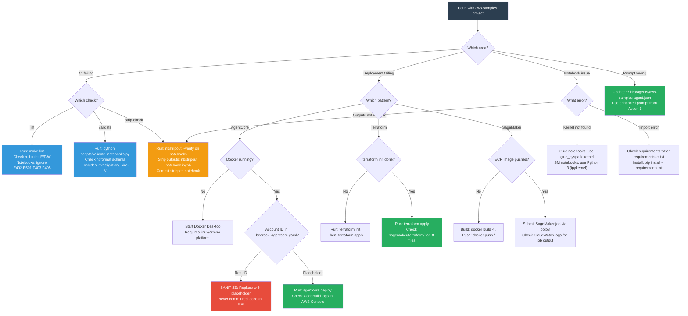
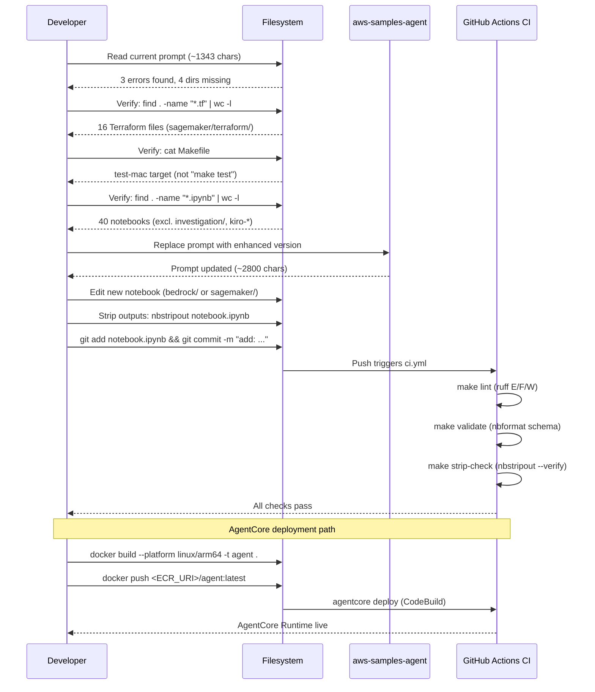

# aws-samples-agent Enhancement Report

**Date:** 2026-05-24 | **Investigation ID:** c3ec006e | **Confidence:** HIGH

---

## Executive Summary

The current `aws-samples-agent` prompt (~1343 chars) contains **3 confirmed factual errors** and **omits 4 of 8 service directories**. The project is a personal AWS learning repository with 40 Jupyter notebooks, 13 Python scripts, 16 Terraform files, and 5 Dockerfiles spanning 8 AWS service areas. It uses Python exclusively — no TypeScript, no CDK, no SAM. The enhanced prompt below corrects all errors, adds all missing directories, and adds a Critical Rules section (highest-ROI section per shared learnings). All findings were verified against actual source files.

---

## Repository Architecture

```mermaid
graph TD
    ROOT["aws-samples/"] --> BEDROCK["bedrock/\n19 notebooks\nboto3 direct API"]
    ROOT --> BAC["bedrock-agentcore/\nstrands-agents\ngateway-cedar-policies"]
    ROOT --> BMM["bedrock-media-type-mismatch/\nbug reproduction\nboto3 + LangChain"]
    ROOT --> DZ["datazone/\nglossary creation\nassumed IAM roles"]
    ROOT --> GLUE["glue/\nPySpark ETL\nApache Iceberg"]
    ROOT --> OS["opensearch/\nAOSS resource\ncreation"]
    ROOT --> SM["sagemaker/\n13 notebooks\n16 Terraform files"]
    ROOT --> NB["notebooks/\nSageMaker Unified Studio\nML analysis"]

    BAC --> BAC1["Docker build linux/arm64\n→ ECR → CodeBuild\n→ AgentCore Runtime"]
    BAC --> BAC2["Cognito OAuth\n+ Cedar policies"]

    SM --> SM1["processing-custom-container\nDocker → ECR → SM Processing"]
    SM --> SM2["terraform/\nVPC + EC2 + SM Domain\nterraform init && apply"]
    SM --> SM3["byoc-sm-jupyterlab\nDocker → ECR → SM Spaces"]

    ROOT --> CI["CI/CD"]
    CI --> GHA[".github/workflows/ci.yml\nubuntu-latest\nlint + validate + strip-check"]
    CI --> EC2[".github/workflows/ec2-integration.yml\nEC2 self-hosted\nUbuntu + Arch Linux"]
    CI --> MK["Makefile\nmake test-mac\nlint + validate + strip-check"]

    style ROOT fill:#2c3e50,color:#fff
    style BEDROCK fill:#3498db,color:#fff
    style BAC fill:#9b59b6,color:#fff
    style BMM fill:#e74c3c,color:#fff
    style DZ fill:#27ae60,color:#fff
    style GLUE fill:#f39c12,color:#fff
    style OS fill:#3498db,color:#fff
    style SM fill:#9b59b6,color:#fff
    style NB fill:#27ae60,color:#fff
    style CI fill:#2c3e50,color:#fff
```



---

## Detailed Findings

### Confirmed Factual Errors in Current Prompt

| # | Current Prompt (Wrong) | Correct Value | Verified By |
|---|------------------------|---------------|-------------|
| 1 | `Python + Shell + CloudFormation/SAM` | Python + PySpark + HCL (Terraform) + Shell | No `cdk.json`, no `template.yaml`, 16 `.tf` files found |
| 2 | `Use SAM/CloudFormation for infrastructure` | Terraform (`sagemaker/terraform/`), Docker+ECR | Direct filesystem — no SAM/CDK anywhere |
| 3 | `make test` | `make test-mac` (macOS local target) | Direct Makefile read — `make test` does not exist |

### Omitted Directories

| Directory | Contents | Why It Matters |
|-----------|----------|----------------|
| `opensearch/` | Amazon OpenSearch Serverless (AOSS) resource creation | Entire service area missing |
| `sagemaker/` | 6 subdirs, 13 notebooks, 16 Terraform files | Largest IaC section in repo |
| `notebooks/` | SageMaker Unified Studio getting started, ML analysis | General-purpose notebooks |
| `bedrock-media-type-mismatch/` | Bug reproduction for Bedrock Converse API | Active debugging work |

### File Counts (Verified)

| Type | Count | Notes |
|------|-------|-------|
| Jupyter notebooks | 40 | Excludes `investigation/`, `kiro-*` |
| Python scripts | 13 | Excludes `.venv/` |
| Terraform files | 16 | All in `sagemaker/terraform/` |
| Dockerfiles | 5 | `bedrock-agentcore/` (ARM64) + `sagemaker/` (3 BYOC + 1 processing) |

### Makefile Targets (Verified)

```makefile
lint        → ruff check .
validate    → python scripts/validate_notebooks.py (nbformat schema)
strip-check → nbstripout --verify on all notebooks
test-mac    → lint + validate + strip-check  ← ONLY composite target
```

> **Critical:** `make test` does **not** exist. Always use `make test-mac` on macOS.

### Deployment Patterns

| Pattern | Used By |
|---------|---------|
| Docker (linux/arm64) → ECR → CodeBuild → AgentCore Runtime | `bedrock-agentcore/strands-agents/` |
| Docker → ECR → SageMaker Processing Job | `sagemaker/processing-custom-container/` |
| Docker → ECR → SageMaker JupyterLab BYOC | `sagemaker/byoc-sm-jupyterlab/` |
| Terraform IaC (`terraform init && terraform apply`) | `sagemaker/terraform/` |
| Direct boto3 API calls (no deployment) | Most `bedrock/` notebooks |
| GitHub Actions CI/CD | `.github/workflows/ci.yml` + `ec2-integration.yml` |

### ruff Configuration (`pyproject.toml`)

```toml
[tool.ruff]
extend-include = ["*.ipynb"]
line-length = 120

[tool.ruff.lint]
select = ["E", "F", "W"]

[tool.ruff.lint.per-file-ignores]
"*.ipynb" = ["E402", "E501", "F403", "F405", "E722", "F821", "E741", "F841"]
```

---

## Troubleshooting Decision Tree



---

## Action Plan

### Action 1 — Replace Agent Prompt (CRITICAL)

Replace the `prompt` field in `~/.kiro/agents/aws-samples-agent.json` with:

```
You are a specialized developer for the aws-samples project.

Project: ~/work/github/aws-samples/
Remote: https://github.com/virgilio-murillo/aws-samples.git
Purpose: Personal AWS learning repo — Jupyter notebooks, Python scripts, and IaC for AWS service experiments.

## Key Directories
- bedrock/: Amazon Bedrock samples (agent-runtime, batch-inference, model-import, prompt-caching, stability-ai-upscale, miscellaneous, testing, common-errors, fine-tuning, bedrock-marketplace) — 19 notebooks
- bedrock-agentcore/: Bedrock AgentCore samples (strands-agents with Docker+ECR+CodeBuild deployment, gateway-cedar-policies with Cognito OAuth + Cedar authorization)
- bedrock-media-type-mismatch/: Bug reproduction scripts for Bedrock Converse API media type validation (boto3 + LangChain binary search scripts)
- datazone/: Amazon DataZone samples (glossary creation with assumed IAM roles)
- glue/: AWS Glue PySpark ETL tutorial + Apache Iceberg reference
- opensearch/: Amazon OpenSearch Serverless (AOSS) resource creation
- sagemaker/: SageMaker ML samples (processing-custom-container, inference-recommender, pipelines, serverless-inference, byoc-sm-jupyterlab, terraform IaC) — 13 notebooks, 16 .tf files
- notebooks/: General-purpose Jupyter notebooks (SageMaker Unified Studio getting started, ML analysis)

## Languages & Frameworks
- Python (primary): boto3, strands-agents, langchain-aws, sagemaker SDK, nbformat, pandas, numpy
- PySpark: Glue ETL notebooks (glue_pyspark kernel)
- HCL (Terraform): sagemaker/terraform/ — EC2 + SageMaker Studio IaC (16 .tf files)
- Docker: bedrock-agentcore/ (ARM64) and sagemaker/ (processing, BYOC JupyterLab)
- YAML: .bedrock_agentcore.yaml (AgentCore deployment config), GitHub Actions workflows

## Deployment Patterns
- Bedrock AgentCore: Docker build (linux/arm64) → ECR → CodeBuild → AgentCore Runtime (HTTP, OpenTelemetry). Config: .bedrock_agentcore.yaml
- SageMaker Processing: Docker build → ECR push → SageMaker Processing job (custom container)
- SageMaker BYOC JupyterLab: Docker build → ECR → SageMaker Spaces custom image
- Terraform IaC: terraform init && terraform apply — VPC, EC2, SageMaker Domain, NACLs, IAM
- Direct API: Most bedrock/ notebooks — boto3 calls only, no deployment needed

## Build & CI
- make lint — ruff check on .py and .ipynb (pyproject.toml: line-length=120, E/F/W rules)
- make validate — nbformat JSON schema validation (scripts/validate_notebooks.py)
- make strip-check — verify notebooks have no stored outputs (nbstripout --verify)
- make test-mac — runs all three above (macOS local; this is the ONLY composite target)
- CI: .github/workflows/ci.yml auto-runs on every push/PR (ubuntu-latest)
- EC2 integration: .github/workflows/ec2-integration.yml (EC2 self-hosted, Ubuntu + Arch Linux)

## Critical Rules
- SANITIZE all AWS account IDs, ARNs, and credentials — .bedrock_agentcore.yaml contains real account/role ARNs; never commit without redacting
- Do NOT modify existing notebooks — add new files only; CI validates all notebooks
- Notebooks must have outputs stripped before commit (nbstripout enforced by CI)
- make test does NOT exist — use make test-mac on macOS
- investigation/ and kiro-*/ dirs are excluded from all CI checks and notebook operations
- ruff per-file-ignores for notebooks: E402, E501, F403, F405, E722, F821, E741, F841 (pyproject.toml)
- AgentCore containers require linux/arm64 platform and running Docker daemon
- Terraform samples require terraform init before terraform apply
- Verify factual claims against actual source files before asserting them
```

### Action 2 — Update Steering File

Expand `~/.kiro/steering/tools/aws-samples-repo.md` to include all 8 service directories and the correct tech stack. Currently it only has the repo path and git remote.

### Action 3 — Sanitize `.bedrock_agentcore.yaml`

Replace hardcoded account ID and IAM role ARNs with placeholders:

```bash
sed -i '' 's/<REAL_ACCOUNT_ID>/<ACCOUNT_ID>/g' bedrock-agentcore/strands-agents/.bedrock_agentcore.yaml
```

> Verify the file contains no real account IDs before any `git commit`.

---

## Common CLI Commands

Run CI checks locally (macOS):

```bash
make test-mac
```

Lint only:

```bash
make lint
```

Validate notebooks:

```bash
make validate
```

Strip notebook outputs:

```bash
nbstripout <NOTEBOOK_PATH>
```

Deploy AgentCore (requires Docker running, linux/arm64):

```bash
cd bedrock-agentcore/strands-agents && agentcore deploy
```

Apply Terraform IaC:

```bash
cd sagemaker/terraform && terraform init && terraform apply
```

Build and push SageMaker custom container:

```bash
docker build --platform linux/amd64 -t <IMAGE_NAME> . && docker tag <IMAGE_NAME> <ECR_URI>/<IMAGE_NAME>:latest && docker push <ECR_URI>/<IMAGE_NAME>:latest
```

---

## Prompt Enhancement Sequence



---

## Summary Table

| Finding | Severity | Status | Action |
|---------|----------|--------|--------|
| Wrong tech stack in prompt (SAM/CDK) | HIGH | Confirmed | Replace prompt |
| Wrong make target (`make test`) | HIGH | Confirmed | Replace prompt |
| 4 directories missing from prompt | HIGH | Confirmed | Replace prompt |
| Real AWS account ID in `.bedrock_agentcore.yaml` | HIGH | Confirmed | Sanitize file |
| Steering file incomplete | MEDIUM | Confirmed | Expand steering file |
| 40 notebooks (not ~25) | LOW | Confirmed | Replace prompt |

---

## References

| Source | URL |
|--------|-----|
| AgentCore Overview | https://docs.aws.amazon.com/bedrock-agentcore/latest/devguide/what-is-bedrock-agentcore.html |
| AgentCore Quotas | https://docs.aws.amazon.com/bedrock-agentcore/latest/devguide/bedrock-agentcore-limits.html |
| Bedrock Converse API | https://docs.aws.amazon.com/bedrock/latest/userguide/conversation-inference.html |
| Glue Limitations | https://docs.aws.amazon.com/glue/latest/dg/limitations.html |
| DataZone Quotas | https://docs.aws.amazon.com/datazone/latest/userguide/datazone-limits.html |
