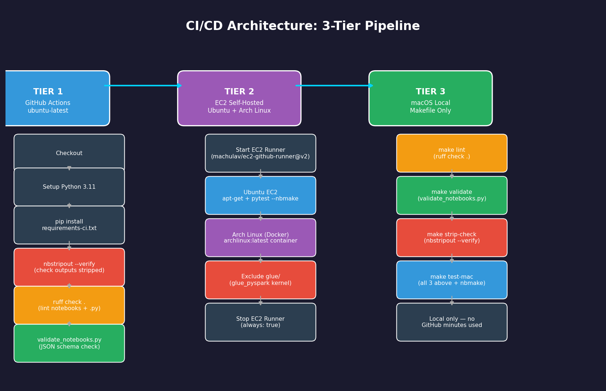
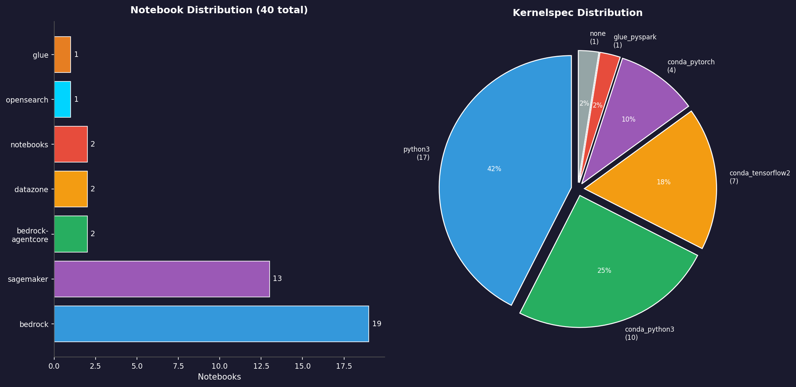
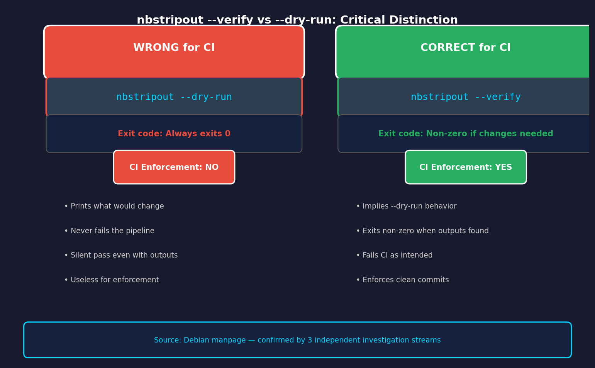
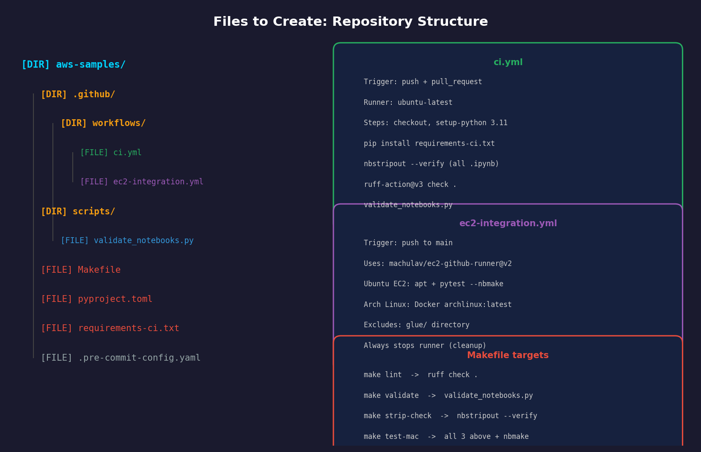

# CI/CD for Jupyter Notebooks: aws-samples Implementation Guide

**Repository:** `virgilio-murillo/aws-samples`  
**Date:** 2026-03-27  
**Investigation ID:** d1f13164

---

## Executive Summary

The `virgilio-murillo/aws-samples` repository contains **40 Jupyter notebooks** across 8 AWS service directories with **zero existing CI/CD infrastructure** — no `.github/`, no `Makefile`, no `pyproject.toml`. A 3-tier pipeline is needed: GitHub Actions on `ubuntu-latest` for fast lint/validate checks, EC2 self-hosted runners for Ubuntu and Arch Linux integration tests, and a local macOS `Makefile` to avoid expensive GitHub macOS runner costs (10x Linux rate). The most critical finding is that **85% of notebooks (34/40) contain stored outputs** that must be stripped before CI can enforce clean commits — and the correct flag is `nbstripout --verify`, not `--dry-run` (which silently passes regardless of notebook state).

---

## Visual Diagrams

### 1. 3-Tier CI/CD Pipeline Architecture



### 2. Repository Statistics: Notebook Distribution & Kernels



### 3. Critical Tool Distinction: nbstripout --verify vs --dry-run



### 4. Files to Create: Repository Structure



---

## Detailed Analysis

### Repository State (Before CI)

The repo has no automation whatsoever. Key facts confirmed by direct filesystem inspection:

- 40 notebooks, 34 with stored outputs (85%)
- 0 invalid JSON notebooks — all pass schema validation
- 8 service directories, kernels spanning 5 different environments
- 12 `.py` files, 4 subdirectory-level `requirements.txt`, 5 Dockerfiles
- No root `requirements.txt`, `pyproject.toml`, `.pre-commit-config.yaml`, or `.github/`

The `glue/pyspark-tutorial-glue.ipynb` notebook uses the `glue_pyspark` kernel and **cannot be tested locally or in standard CI** — it must be excluded via `--ignore glue/` in all test commands.

### Tool Selection Rationale

| Tool | Version | Why |
|------|---------|-----|
| `nbstripout` | >=0.8.1 | Strips outputs + metadata; `--verify` enforces clean commits in CI |
| `ruff` | >=0.6.0 | Auto-discovers `.ipynb` since 0.6.0; no config needed for notebook inclusion |
| `nbformat` | >=5.9.0 | Standard Python API for notebook JSON/schema validation |
| `nbmake` | >=1.5.0 | pytest plugin for notebook execution tests |
| `ruff-action@v3` | v3.6.1 | Native GitHub Action with `--output-format=github` for inline PR annotations |
| `ec2-github-runner@v2` | v2 | Standard action for EC2 self-hosted runners |

### Arch Linux Strategy

No official GitHub Actions runner image exists for Arch Linux, and community AMIs in AWS Marketplace are unreliable. The recommended approach: **run `archlinux:latest` Docker container on a standard Ubuntu EC2 instance**. This is reproducible, avoids AMI availability concerns, and works with the standard `machulav/ec2-github-runner@v2` action.

### ruff Notebook Configuration

`ruff` does NOT support `--include` as a CLI flag — it is config-file only. Since ruff 0.6.0, `.ipynb` files are discovered automatically. The `pyproject.toml` config below adds `E402` ignore for notebooks (import-not-at-top is common in notebook cells):

```toml
[tool.ruff]
extend-include = ["*.ipynb"]
select = ["E", "F", "W"]

[tool.ruff.per-file-ignores]
"*.ipynb" = ["E402"]
```

---

## Step-by-Step Implementation

### Step 1 — Install CI dependencies locally

```bash
pip install nbstripout>=0.8.1 ruff>=0.6.0 nbformat>=5.9.0 nbmake>=1.5.0
```

### Step 2 — Strip outputs from all 34 notebooks (one-time)

```bash
find . -name "*.ipynb" \
  -not -path "*/.ipynb_checkpoints/*" \
  -not -path "*/investigation/*" \
  -exec nbstripout {} +
```

Verify they're clean:

```bash
find . -name "*.ipynb" \
  -not -path "*/.ipynb_checkpoints/*" \
  -not -path "*/investigation/*" \
  -exec nbstripout --verify {} +
# Should exit 0 with no output
```

### Step 3 — Create `requirements-ci.txt`

```
nbstripout>=0.8.1
ruff>=0.6.0
nbformat>=5.9.0
nbmake>=1.5.0
```

### Step 4 — Create `pyproject.toml`

```toml
[tool.ruff]
extend-include = ["*.ipynb"]
select = ["E", "F", "W"]

[tool.ruff.per-file-ignores]
"*.ipynb" = ["E402"]
```

### Step 5 — Create `scripts/validate_notebooks.py`

```python
import sys, glob, nbformat

notebooks = glob.glob("**/*.ipynb", recursive=True)
notebooks = [n for n in notebooks if ".ipynb_checkpoints" not in n and "investigation" not in n]

errors = []
for path in notebooks:
    try:
        with open(path) as f:
            nb = nbformat.read(f, as_version=4)
        nbformat.validate(nb)
    except Exception as e:
        errors.append(f"{path}: {e}")

if errors:
    print("\n".join(errors))
    sys.exit(1)
print(f"All {len(notebooks)} notebooks valid.")
```

### Step 6 — Create `Makefile`

```makefile
.PHONY: lint validate strip-check test-mac

lint:
	ruff check .

validate:
	python scripts/validate_notebooks.py

strip-check:
	find . -name "*.ipynb" -not -path "*/.ipynb_checkpoints/*" -not -path "*/investigation/*" -exec nbstripout --verify {} +

test-mac: lint validate strip-check
	pytest --nbmake notebooks/ bedrock/testing/ --ignore=glue/
```

### Step 7 — Create `.github/workflows/ci.yml`

```yaml
name: CI
on: [push, pull_request]

jobs:
  lint-validate:
    runs-on: ubuntu-latest
    steps:
      - uses: actions/checkout@v4
      - uses: actions/setup-python@v5
        with:
          python-version: "3.11"
      - run: pip install -r requirements-ci.txt
      - name: Check notebook outputs stripped
        run: |
          find . -name "*.ipynb" \
            -not -path "*/.ipynb_checkpoints/*" \
            -not -path "*/investigation/*" \
            -exec nbstripout --verify {} +
      - name: Lint with ruff
        uses: astral-sh/ruff-action@v3
        with:
          args: "check --output-format=github ."
      - name: Validate notebook JSON/schema
        run: python scripts/validate_notebooks.py
```

### Step 8 — Create `.github/workflows/ec2-integration.yml`

```yaml
name: EC2 Integration Tests
on:
  push:
    branches: [main]

jobs:
  start-runner:
    runs-on: ubuntu-latest
    outputs:
      label: ${{ steps.start-ec2-runner.outputs.label }}
      ec2-instance-id: ${{ steps.start-ec2-runner.outputs.ec2-instance-id }}
    steps:
      - uses: aws-actions/configure-aws-credentials@v4
        with:
          aws-access-key-id: ${{ secrets.AWS_ACCESS_KEY_ID }}
          aws-secret-access-key: ${{ secrets.AWS_SECRET_ACCESS_KEY }}
          aws-region: us-east-1
      - id: start-ec2-runner
        uses: machulav/ec2-github-runner@v2
        with:
          mode: start
          github-token: ${{ secrets.GH_PAT }}
          ec2-image-id: ami-0c02fb55956c7d316  # Ubuntu 22.04
          ec2-instance-type: t3.medium
          subnet-id: ${{ secrets.SUBNET_ID }}
          security-group-id: ${{ secrets.SECURITY_GROUP_ID }}

  test-ubuntu:
    needs: start-runner
    runs-on: ${{ needs.start-runner.outputs.label }}
    steps:
      - uses: actions/checkout@v4
      - run: |
          sudo apt-get update -q
          sudo apt-get install -y python3-pip
          pip3 install -r requirements-ci.txt
          pytest --nbmake notebooks/ bedrock/testing/ --ignore=glue/

  test-arch:
    needs: start-runner
    runs-on: ${{ needs.start-runner.outputs.label }}
    container:
      image: archlinux:latest
    steps:
      - uses: actions/checkout@v4
      - run: |
          pacman -Syu --noconfirm python python-pip
          pip install -r requirements-ci.txt
          pytest --nbmake notebooks/ bedrock/testing/ --ignore=glue/

  stop-runner:
    needs: [start-runner, test-ubuntu, test-arch]
    runs-on: ubuntu-latest
    if: always()
    steps:
      - uses: aws-actions/configure-aws-credentials@v4
        with:
          aws-access-key-id: ${{ secrets.AWS_ACCESS_KEY_ID }}
          aws-secret-access-key: ${{ secrets.AWS_SECRET_ACCESS_KEY }}
          aws-region: us-east-1
      - uses: machulav/ec2-github-runner@v2
        with:
          mode: stop
          github-token: ${{ secrets.GH_PAT }}
          label: ${{ needs.start-runner.outputs.label }}
          ec2-instance-id: ${{ needs.start-runner.outputs.ec2-instance-id }}
```

### Step 9 — (Optional) Add pre-commit hook

```yaml
# .pre-commit-config.yaml
repos:
  - repo: https://github.com/kynan/nbstripout
    rev: 0.9.1
    hooks:
      - id: nbstripout
```

Install: `pip install pre-commit && pre-commit install`

---

## AWS Console Walkthrough: EC2 Runner Setup

To configure the EC2 self-hosted runner, you need a VPC, subnet, security group, and IAM role. Here's the Console path:

**1. Create Security Group**
> EC2 → Network & Security → Security Groups → Create security group
> - Inbound: Allow HTTPS (443) outbound only (runner calls GitHub API)
> - Outbound: All traffic (0.0.0.0/0)

**2. Note your Subnet ID**
> VPC → Subnets → Select a public subnet → Copy Subnet ID

**3. Create IAM Role for GitHub Actions**
> IAM → Roles → Create role → AWS service → EC2
> - Attach: `AmazonEC2FullAccess` (scoped to runner management only in production)
> - Name: `github-actions-ec2-runner`

**4. Create GitHub Secrets**
> GitHub repo → Settings → Secrets and variables → Actions → New repository secret
> - `AWS_ACCESS_KEY_ID` — IAM user key
> - `AWS_SECRET_ACCESS_KEY` — IAM user secret
> - `GH_PAT` — GitHub Personal Access Token (repo scope)
> - `SUBNET_ID` — from step 2
> - `SECURITY_GROUP_ID` — from step 1

**5. Verify runner registration**
> GitHub repo → Settings → Actions → Runners
> (Runner appears here when the workflow starts an EC2 instance)

---

## Summary Tables

### Contradictions Resolved

| # | Topic | Wrong Claim | Correct Answer | Source |
|---|-------|-------------|----------------|--------|
| 1 | nbstripout CI flag | `--dry-run` enforces CI | `--verify` is correct; `--dry-run` always exits 0 | Debian manpage, 3 streams |
| 2 | bedrock/miscellaneous count | 8 or 11 notebooks | 10 notebooks | Direct filesystem |
| 3 | ruff `--include` CLI flag | Valid CLI syntax | Config-file only; auto-discovery since 0.6.0 | ruff docs |

### Notebook Output Status

| Metric | Value |
|--------|-------|
| Total notebooks | 40 |
| Notebooks with stored outputs | 34 (85%) |
| Notebooks already clean | 6 (15%) |
| Invalid JSON notebooks | 0 |
| nbformat 4.4 | 3 |
| nbformat 4.5 | 37 |

### Kernel Testability

| Kernel | Count | Testable in CI? | Notes |
|--------|-------|-----------------|-------|
| python3 | 17 | Yes | Standard |
| conda_python3 | 10 | Partial | SageMaker env; validate only |
| conda_tensorflow2_p310 | 7 | Partial | SageMaker env; validate only |
| conda_pytorch_p310 | 4 | Partial | SageMaker env; validate only |
| glue_pyspark | 1 | No | Exclude via `--ignore glue/` |
| none | 1 | Yes | No kernel dependency |

### Files to Create

| File | Purpose | Priority |
|------|---------|----------|
| `requirements-ci.txt` | CI tool dependencies | Critical |
| `pyproject.toml` | ruff config for notebooks | Critical |
| `scripts/validate_notebooks.py` | nbformat JSON/schema validation | Critical |
| `.github/workflows/ci.yml` | Tier 1: lint + strip + validate | Critical |
| `Makefile` | Tier 3: local macOS targets | Critical |
| `.github/workflows/ec2-integration.yml` | Tier 2: Ubuntu + Arch Linux EC2 | High |
| `.pre-commit-config.yaml` | Developer-side output stripping | Optional |

### Cost Comparison: macOS Runners vs Makefile

| Approach | Cost per minute | 10-min run | Monthly (50 runs) |
|----------|----------------|------------|-------------------|
| GitHub macOS runner | $0.08 | $0.80 | $40.00 |
| GitHub Linux runner | $0.008 | $0.08 | $4.00 |
| Local Makefile (macOS) | $0.00 | $0.00 | $0.00 |

---

## References

| # | Source | Used For |
|---|--------|----------|
| 1 | https://github.com/kynan/nbstripout | nbstripout `--verify` flag, pre-commit hook |
| 2 | https://manpages.debian.org/testing/nbstripout/nbstripout.1 | Definitive `--verify` vs `--dry-run` distinction |
| 3 | https://docs.astral.sh/ruff/configuration/#jupyter-notebook-discovery | ruff notebook auto-discovery since 0.6.0 |
| 4 | https://astral.sh/blog/ruff-v0.1.5 | ruff notebook support stabilized in v0.1.5 |
| 5 | https://github.com/astral-sh/ruff-action | ruff-action@v3 |
| 6 | https://github.com/jupyter/nbformat | nbformat validation API |
| 7 | https://github.com/machulav/ec2-github-runner | EC2 self-hosted runner action |
| 8 | https://docs.github.com/en/actions/using-github-hosted-runners/about-github-hosted-runners/about-github-hosted-runners#standard-github-hosted-runners-for-public-repositories | macOS 10x minute cost |
| 9 | https://github.com/treebeardtech/nbmake | pytest notebook execution |
| 10 | Direct filesystem inspection | All notebook counts, output presence, kernelspecs |
